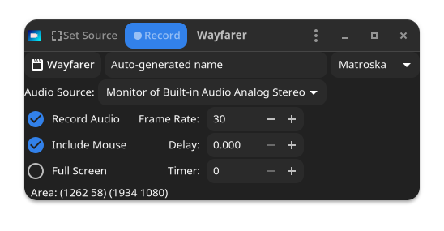

# Wayfarer - Screen Recorder for GNOME / Wayland / Pipewire

## Features and limitations

**wayfarer** is a screen recorder for GNOME

* Modern GNOME desktop (Arch, Fedora, Debian Testing, Ubuntu 22.04)
* Wayland or Xorg
* Pipewire / Pusleaudio / libportal (XDG Desktop Portal)
* Wireplumber recommended

Does not support other desktops.

Requires:

* GTK 3
* Vala
* Gstreamer 1.0
* AppIndicator
* XDG Portal

There is also a  GTK4 branch

* GTK 4
* Vala
* Gstreamer 1.0
* XDG Portal
* (optional, can be installed locally by the build system), Blueprint (GTK Builder compiler).

**wayfarer** supports MKV, MP4 and WEB video container (vp8, mp4) and Opus as the audio format.

wayfarer uses the XDG Portal on modern Gnome desktops, with all the pain and diminished functionality that implies.

* Portal connection is set to persist, pressing Control-P clears the persistent state, re-enabling the portal monitor selection screen.
* Selection across multiple monitors and full screen across multiple monitors is available
* Window selection is not supported, as the libportal support is not useful.

## Building

Appindicator is a build time GTK3 (only) dependency; at runtime, if you have an appindicator Gnome Shell extension installed, you can use the indicator to stop recording; without such an indicator, you can use Notification, with a less good user experience.

* For Arch Linux, install `libappindicator-gtk3`.
* On Debian / Ubuntu et al the app indicator package is called `libayatana-appindicator3-dev` and you also need `gir1.2-ayatanaappindicator3-0.1`.
* For Fedora, try `libappindicator-gtk3-devel`

For GTK4, a small "Stop Recording" window is displayed instead.

Other requirements:

* `libportal`
* `gstreamer-vaapi`
* `gst-inspect-1.0`, used to check if a vaapi H264 encoder is available.

The build system is meson / ninja, e.g.

```
meson build --buildtype=release --prefix=~/.local
# then
meson install -C build
```

## User Interface



* Define an area using the `Set Source` control. Drag the displayed control to size, ESC to abort.
* Select the audio source
* `Delay` defines a delay (seconds) before recording starts
* `Timer` defines the length of the recording (seconds) : 0 (default) means user will stop the recording.
* `Record` starts the recording; requires a file name and either an area defined or `Fullscreen`

Once recording is started:

* If `Timer` is set, the recording will run for the set number of seconds
* GTK3: If an AppIndicator tray is used, there will be an icon in the system tray, clicking this provides a "Stop Recording" button.
* GTK4: A small window provides a "Stop Recording" button.
* Otherwise, use the "Preferences" menu and set `Use notifications (vice App Indicator)`. Clicking on the notification will stop the recording.

The menu button at the right of the header bar offers three options:

* Preferences
* About
* Quit (or use the header bar close button)

### Preferences


* Use Notifications for ready : if set, a notification count down is shown for delays > 2 seconds.
* Use notifications (vice App Indicator). Provides a persistent Notification to stop recordings; mainly needed if you don't have an AppIndicator tray shell extension (on GTK3).

Preferences are stored as a simple `key = value` text file in `~/.config/wayfarer/cap.conf`.


## Miscellaneous

Licence : GPL v3 or later
(c) Jonathan Hudson 2021,2022

Inspired by other fine tools such as **kooha**,  **peek** and **green-recorder**; I appreciate the developer's pain with the moving targets of Gnome, Wayland, Pipewire and XDG Portal.
